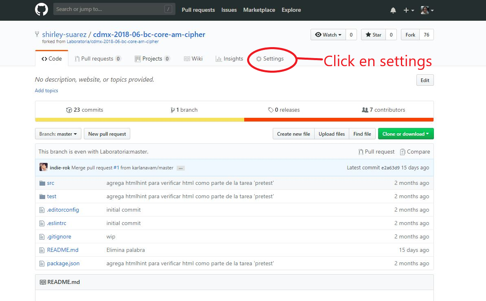
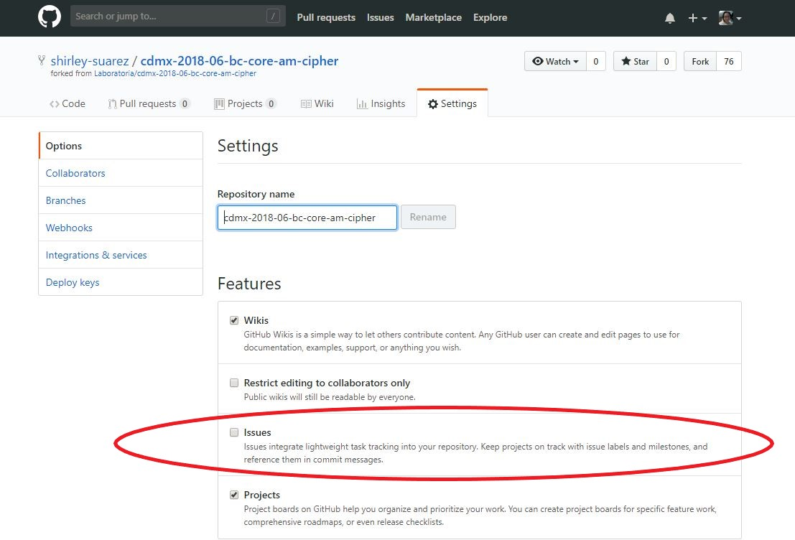
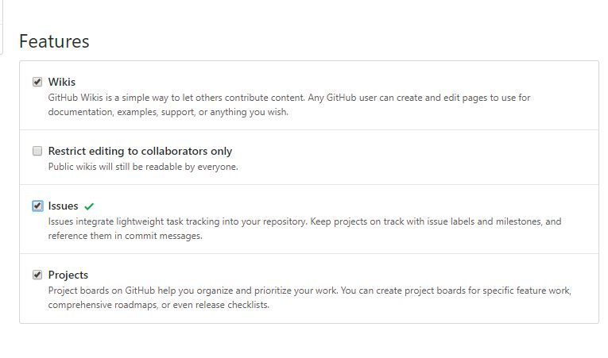
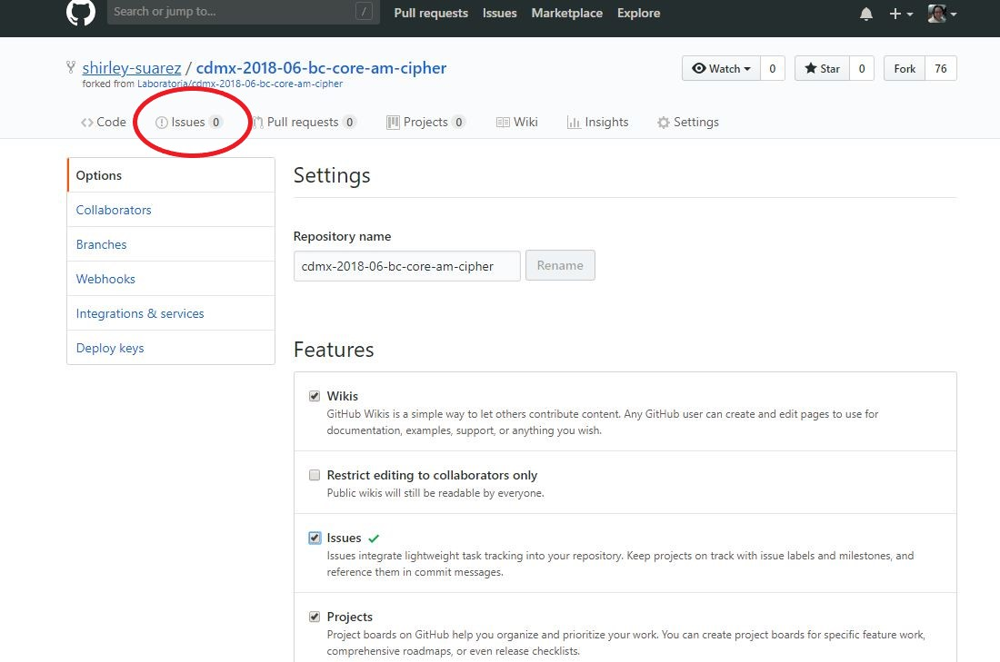

# Activar la etiqueta de Issues en Github
### Para poder activar la etiqueta de **Issues** debes de colocarte dentro de tu repositorio donde esperas recibir o realizar los issues (ej. cipher) y seguir los pasos a continuación:

#### Paso 1: Haz click en settings.

#### Paso 2: Una vez en settings busca en Features la opción Issues.

#### Paso 3: Palomeas (activar checkbox) la opción  **Issues**

#### Paso 4: Ya deberias de tener  la etiqueta de **Issues**.

#### Ya puedes empezar a realizar tus Issues de tu proyecto.
